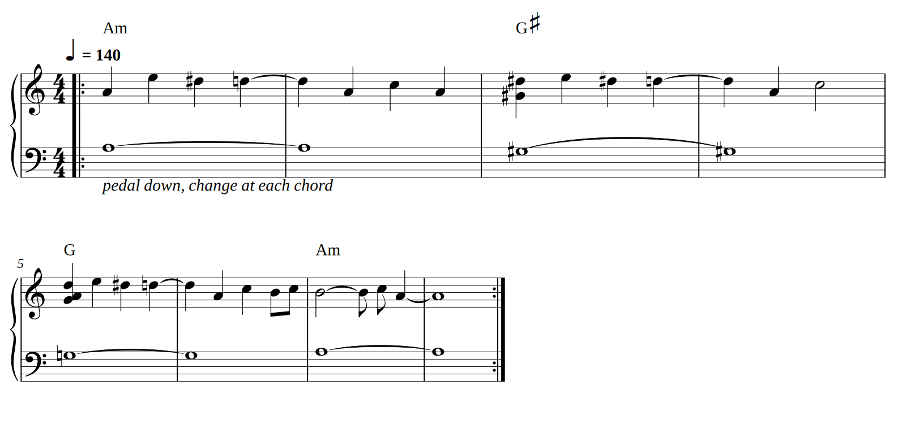

# Piano part (from your keyboard recording)

Transcribed from your own 16-second keyboard recording, not from the song preview. The earlier version was transcribed from the full mix and was wrong; this replaces it completely.

**Key** A minor · **Tempo** 140 BPM · **Time** 4/4 · **Form** one 8-bar loop, repeated · **Pedal** down, change it when the bass note changes

| File | Use it for |
|---|---|
| `piano-part.pdf` / `piano-part.png` | Sheet music |
| `piano-part.mid` | Any piano-learning app, GarageBand or MuseScore. Two tracks: right hand, left hand. |
| `piano-part.musicxml` | Editable score for MuseScore, Flat or Noteflight |
| `hook-trainer.html` | Open in a browser: falling notes over a keyboard, slow it down, loop a phrase, mute a hand |

## Bar by bar

Count 1 2 3 4 in every bar. ⌒ means keep holding. "3-and" is halfway between beats 3 and 4. Right-hand notes are around the A just above middle C (A4 to E5).

| Bar | Chord | Right hand (beats 1 · 2 · 3 · 4) | Left hand |
|---|---|---|---|
| 1 | Am | **A · E · D♯ · D**⌒ | A3, hold 2 bars |
| 2 | Am | D⌒ · **A · C · A** | ⌒ |
| 3 | G♯ | **G♯+D♯ · E · D♯ · D**⌒ | G♯3, hold 2 bars |
| 4 | G♯ | D⌒ · **A · C**⌒ (hold) | ⌒ |
| 5 | G | **G+A+D · E · D♯ · D**⌒ | G3, hold 2 bars |
| 6 | G | D⌒ · **A · C · B-C** (two quick notes on beat 4) | ⌒ |
| 7 | Am | **B**⌒ (hold) · · **C** on 3-and · **A**⌒ | A3, hold 2 bars |
| 8 | Am | A⌒ held, then back to bar 1 | ⌒ |

The shape: the hook **E → D♯ → D** comes three times, while the bass slides **A → G♯ → G** a half step at a time and returns to A. Each hook gets an answer starting on A.

Fingering (right hand, thumb on A4): hook E D♯ D = 5 4 3. A C = 1 3. B C B = 2 3 2.

On the repeat, your recording plays a full A-minor chord (A3 C4 E4) in the left hand at bar 1.

## How it was checked

- Notes were detected with two transcription models (Transkun, Basic Pitch) and then checked one by one against the spectrum of your recording. Every note in the score is the loudest pitch within two semitones at its moment.
- Rhythm is snapped to a 140 BPM grid fitted to your playing. Your onsets land within about 10 ms of it.
- A resynthesis of the score matches your recording beat by beat (average pitch-content similarity 0.86). The lower-scoring beats are where your sustain pedal keeps the previous chord ringing.
- Slightly less certain: the quick C between the two B's at the end of bar 6, and whether the G♯ / G on beat 1 of bars 3 and 5 belong to the right hand or are a left-hand octave. Neither changes which keys you press.
